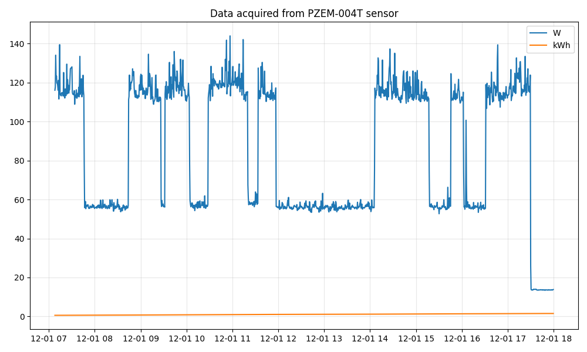

# energy-meter
Using Peacefair PZEM-004T energy sensor for household IoT energy meter

# Pin map

| Pin on MCU | On parts|
| ----------- | ----------- |
| 5V  | V+ (Hi-Link)|
| GND | V- (Hi-Link)|
| D6  | RX (PZEM-004T)|
| D5  | TX (PZEM-004T)|

# Hookup to main breaker

    

# A graph for power with timestamp

    

# A correlation with an offical meter (by EVN, VSE11)

    

# Blog
<a href="https://www.b-io.info/post/tutorial/energy-meter/"> $20 energy meter</a>
