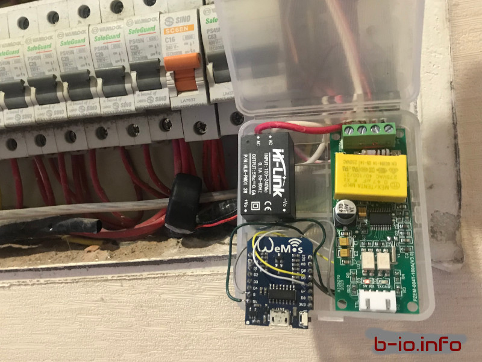

# energy-meter
Using Peacefair PZEM-004T energy sensor for household IoT energy meter

# Pin map

| Pin on MCU | On parts|
| ----------- | ----------- |
| 5V  | V+ (Hi-Link)|
| GND | V- (Hi-Link)|
| D6  | RX (PZEM-004T)|
| D5  | TX (PZEM-004T)|

# Hookup to main breaker

    

